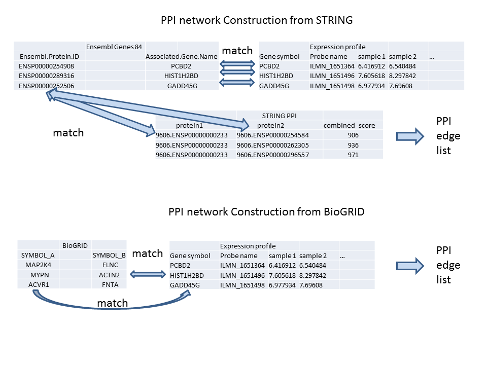

# PPINet
Contructing protein-protein interaction network from multiple data sources:
- Gene expression profiles: to filter gene set in network
- Ensembl: to match gene symbols and protein id
- STRING: one of the most popular PPI databases, edges are donated by Ensembl Protein ID
- BioGRID: one of the most popular PPI databases, edges are donated by OFFICIAL SYMBOL

The basic idea is to determine a significantly expressed gene set based on expression profiles, and match the gene symbols with associated protein ids from popular PPI databases, as the following figure shows:

If you are using this package, please cite the following paper:

Dong Li et. al. Memetic algorithm for finding active connected subnetworks in intracellular networks.
